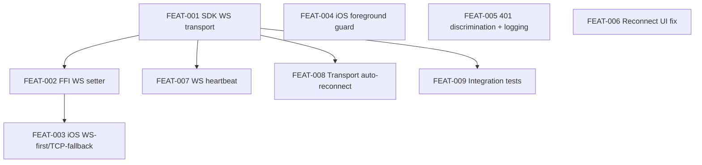

# Release: iOS durable auth

## Goal

Make iOS auth durable across cellular networks, port-blocking firewalls, app
backgrounding, and brief broker/PDS outages — so the user only sees the OAuth
screen when they explicitly log out, switch DIDs, or the upstream refresh
token has been revoked.

## Scope

**In scope**

- WebSocket transport in the Rust SDK (`wss://irc.freeq.at/irc`), parity with
  the JS client's proven implementation.
- TCP-connect timeout + transport-level reconnect/heartbeat (45 s ping /
  90 s dead detection / exponential backoff).
- WebSocket-first / TCP-fallback orchestration on iOS.
- Foreground guard: skip broker round-trip when transport is alive.
- Tighter 401-vs-transient discrimination + diagnostic logging on
  credential clear.
- Reframe the 15-second "Sign in manually" cliff so it no longer drops
  credentials and only appears after realistic broker tail latency.

**Out of scope**

- OAuth / PDS / broker storage architecture changes.
- Watch-app auth (tunnels through the phone — inherits the fix).
- Server-side SASL changes (server already supports both transports).

## Success Outcomes

| ID | Title | Tier |
|----|-------|------|
| O-1 | iOS connects via WebSocket with a connect timeout | Must |
| O-2 | No spurious re-OAuth — broker round-trips skipped when not needed; transient errors don't burn credentials | Must |
| O-3 | No 15-second "Sign in manually" cliff | Must |
| O-4 | SDK heartbeat + auto-reconnect parity with web | Should |
| O-5 | Forensic visibility — diagnostic logging + integration tests | Could |

## Context Summary

See [CONTEXT_BRIEFING.md](CONTEXT_BRIEFING.md) for the full briefing.

Key facts driving this plan:

- `freeq-sdk/src/client.rs:680` — `TcpStream::connect()` has no timeout. On
  port-blocked networks (cellular, captive portals, corp Wi-Fi) the iOS
  app hangs in `.connecting` for the OS-default ~75 s.
- `freeq-sdk/Cargo.toml` does not include `tokio-tungstenite`; the Rust
  SDK has no WebSocket support today.
- `freeq-server/src/web.rs:173` — server `wss://host/irc` endpoint is live
  and proven by the web client. No server changes needed.
- `freeq-sdk-js/src/transport.ts` — proven JS transport with 45 s ping,
  90 s dead detection, exponential backoff. Direct prior art.
- `freeq-ios/freeq/Models/AppState.swift:820-837` — foreground handler does
  not check transport liveness before triggering a broker round-trip.
- `freeq-ios/freeq/ContentView.swift:68-83` — 15-second timer runs from
  first `.onAppear`, not per-attempt; user-visible cliff.
- `AppState.swift:711-781` — 401 discrimination logic exists and is correct
  in shape, but operates without any logging.

## Decisions

| ID | Decision | Reason |
|----|----------|--------|
| D-1 | WebSocket-first with TCP fallback after 10 s timeout | Belt-and-suspenders. Same backend serves both transports, but the rare network that breaks WS framing (HTTP-only middleboxes mishandling upgrade) can still be served via TCP. Cost: ~12 s worst-case connect. Confirmed by user. |
| D-2 | New `websocket` cargo feature on `freeq-sdk`, default-on for `freeq-sdk-ffi` | Matches existing `iroh-transport` pattern. Keeps non-iOS builds (TUI, native CLI) at their current binary size if they don't need WS. |
| D-3 | Mirror JS transport heartbeat parameters (45 s / 90 s / `2^n * 1000` ms) | Proven in production by web client. Don't invent new numbers. |
| D-4 | Reset reconnect timer per attempt; raise cliff threshold from 15 s to 45 s; reframe button to NOT drop credentials | Addresses the actual user-visible failure mode. Auth state is correct underneath; the UI was lying about it. |

## Risks and Assumptions

| ID | Type | Description | Mitigation |
|----|------|-------------|------------|
| R-1 | Risk | `tokio-tungstenite` version compatibility with rustls 0.23 + the chosen crypto provider (`aws-lc-rs` or `ring`) is unverified | First step in FEAT-001 is a compatibility check. If incompatible, fork to SPIKE before continuing. |
| R-2 | Risk | Adding WS adds ~200KB to iOS framework binary | Acceptable trade-off for the durability gain. Already at ~140 MB unstripped. |
| R-3 | Risk | TCP fallback orchestration in iOS could loop if both transports fail | Per-call `transportFallbackUsed` flag (FEAT-003) — fallback runs at most once per `connect(nick:)` invocation. |
| A-1 | Assumption | Server WebSocket endpoint at `wss://irc.freeq.at/irc` is stable | Confirmed: live since web app launch, in production. |
| A-2 | Assumption | iOS `URLSession`-style WS connect-timeout maps cleanly to `tokio::time::timeout` around `tokio_tungstenite::connect_async()` | Validated by Bridget; no platform-specific quirks expected. |
| A-3 | Assumption | The 14-day persistence grace window in AppState already does its job correctly | Verified in source — `consecutive401Count >= 3 && canAutoClearBrokerCredentials` is the only path that clears credentials. FEAT-005 adds logging to confirm. |

## Execution Phases

**Phase 1 — Foundation (Must, can run in parallel where deps allow):**

- FEAT-001: SDK WebSocket transport with connect timeouts
- FEAT-004: iOS foreground guard (independent, ship first as a quick win)
- FEAT-005: Diagnostic logging on credential clear (independent, low risk)
- FEAT-006: Reconnect UI no longer drops credentials at 15 s (independent)

**Phase 2 — Wire it up (Must, depends on Phase 1):**

- FEAT-002: FFI WebSocket URL setter (depends on FEAT-001)
- FEAT-003: iOS uses WS with TCP fallback (depends on FEAT-002)

**Phase 3 — Polish (Should + Could):**

- FEAT-007: WebSocket heartbeat (depends on FEAT-001)
- FEAT-008: Transport-level auto-reconnect (depends on FEAT-001)
- FEAT-009: Integration tests (depends on FEAT-001)

## Dependency Graph

Critical path: **FEAT-001 → FEAT-002 → FEAT-003**.

## Re-planning Triggers

- After FEAT-001 lands: confirm `tokio-tungstenite` version + crypto provider
  compatibility holds. If unstable, escalate to a SPIKE before FEAT-002.
- After FEAT-003 ships to a real device on cellular: validate that user
  actually stops needing to re-OAuth. If not, the broker side is the next
  suspect — reopen scope.
- After FEAT-008 lands: validate that auto-reconnect doesn't fight with iOS
  scene-phase backgrounding (iOS may suspend us mid-retry). May need a
  scene-phase-aware pause/resume on the reconnect loop.

## Ticket Index

| ID | Title | Outcome | Tier |
|----|-------|---------|------|
| [FEAT-001](tickets/FEAT-001.md) | SDK WebSocket transport with connect timeouts | O-1 | Must |
| [FEAT-002](tickets/FEAT-002.md) | FFI: expose WebSocket URL setter | O-1 | Must |
| [FEAT-003](tickets/FEAT-003.md) | iOS: WebSocket-first with TCP fallback | O-1 | Must |
| [FEAT-004](tickets/FEAT-004.md) | iOS: foreground guard | O-2 | Must |
| [FEAT-005](tickets/FEAT-005.md) | 401 discrimination + logging | O-2 | Must |
| [FEAT-006](tickets/FEAT-006.md) | Reconnect UI no longer drops credentials | O-3 | Must |
| [FEAT-007](tickets/FEAT-007.md) | SDK WebSocket heartbeat | O-4 | Should |
| [FEAT-008](tickets/FEAT-008.md) | Transport-level auto-reconnect | O-4 | Should |
| [FEAT-009](tickets/FEAT-009.md) | Integration tests for WS path | O-5 | Could |

## Library Updates

See [library-updates.md](library-updates.md). Conan should review and produce
the surgery plan in conversation (not as a checked-in file).

## Deferred

Nothing deferred from prior plans into this one. (No prior auth-durability
plan existed.)
